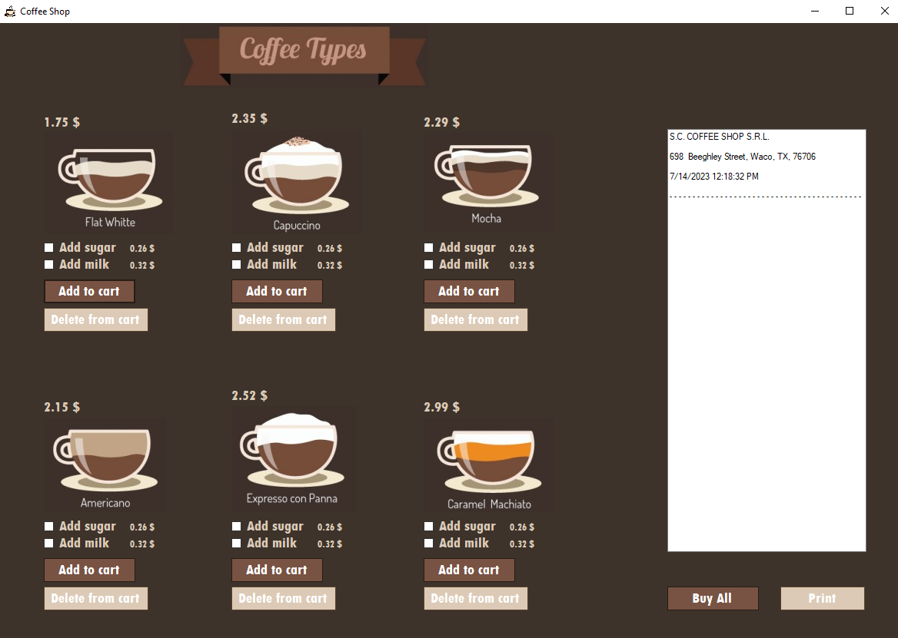

# ☕ Coffee Shop Management - Receipt Printer 🖨️ 


A lightweight C# Form Application designed to facilitate the ordering process at coffee shops. The application lets you select your favorite coffee and prints out a neat receipt at the end of the transaction.

<br>

<p align="center">
  
</p>

## 🎯 Features

1. User-friendly interface for choosing your preferred coffee options.
2. Automatic receipt printing after every order.
3. Detailed breakdown of order, including items, prices, taxes, and total amounts.

## 🔧 Technologies Used

- .NET Framework 4.8
- C#
- Windows Forms

## 🚀 Getting Started

### Prerequisites

- .NET Framework 4.8 or higher
- Visual Studio 2017 or higher

### Installation

1. Clone the repository
```bash
git@github.com:Tonkung004/Coffee-Shop-Management.git
```

## 🤝 Contribution Guidelines
Pull requests are welcome. For major changes, please open an issue first to discuss what you would like to change.

## 📜 License
This project is licensed under the MIT License - see the LICENSE.md file for details.

<br>

<p align="center">
  Enjoy your ☕ with my app! 
</p>


